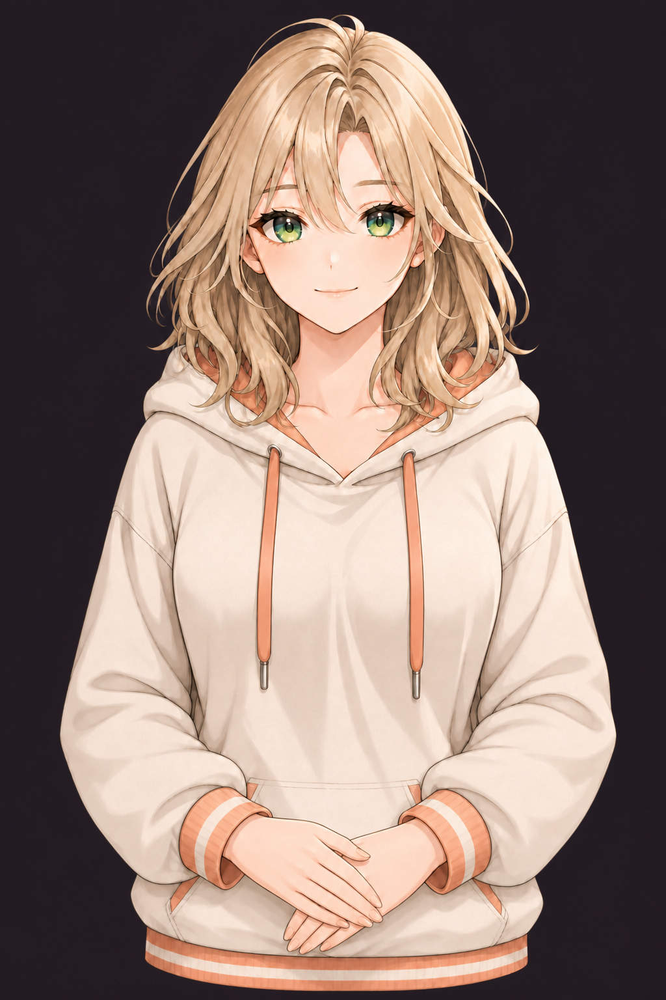

# BoxGirl

Локальный desktop-MVP 2D-аниме-помощницы: текстовый диалог, push-to-talk, сценарные ответы, русский TTS, эмоции, жесты и lip-sync fallback.



## Что уже работает

- оригинальный визуальный образ BoxGirl, единый тёмный studio-stage и семь полных outfit-наборов: уютная худи, летняя майка, спортивная форма, вечернее платье, hacker techwear, роковой офисный костюм и ночной пеньюар;
- состояния `idle`, `listening`, `thinking`, `speaking`, `error`;
- whitelisted-контракт `AssistantTurnV1`;
- локальная Qwen3.5-4B Q4_K_M с CUDA-offload, строгим JSON Schema контрактом и безопасным mocked-fallback;
- по 23 публичных авторских кадра и одной приватной позе для каждого outfit, а также отдельные прозрачные runtime-наборы без `clip-path`, швов и движения фона;
- семь семантических эмоций, blink-пары, отдельные позы рук и покадровые `nod`/`shake_head`;
- WebGL point-rig 24×36 с 16 контрольными точками головы, волос, плеч, рук, корпуса и шнурков;
- точные критически демпфированные пружины, quintic-переходы без резкой смены скорости, нерегулярное моргание, дыхание, one-shot жесты и автономные микрореакции;
- локальная озвучка Silero v5.5 с Baya по умолчанию и Windows Irina как fallback;
- push-to-talk с записью PCM WAV 16 kHz;
- native Tauri-мост к локальному `whisper-cli.exe`;
- browser speech-recognition fallback для web-preview;
- диагностическая панель с FPS и текущим performance-state;
- semantic frame manifest и manifest для будущей Cubism-модели;
- автоматический asset-QA: размер, полнота, прозрачность cutout-набора и качество WebP относительно PNG-мастеров.
- локальные команды `жарко`, `холодно`, `тренировка`, `вечер`, `хакер`, `офис` и `сон`: мягко переключают outfit, не вызывают LLM и сохраняют выбор между запусками.

Крупные веса LLM/ASR/TTS и Cubism `.moc3/.model3.json` не хранятся в репозитории. Проверяемые setup-скрипты устанавливают Qwen и Silero локально в игнорируемый каталог `models`; при отсутствии весов интерфейс остаётся рабочим через безопасные fallback-провайдеры.

## Запуск

```powershell
npm install
npm run setup:llm
npm run setup:silero
npm run dev
```

Desktop-режим:

```powershell
npm run tauri dev
```

Проверки:

```powershell
npm test
npm run build:rig-assets
npm run build:summer-assets
npm run build:gym-assets
npm run build:evening-assets
npm run build:hacker-assets
npm run build:office-assets
npm run build:sleep-assets
npm run qa:avatar
npm run qa:summer-outfit
npm run qa:gym-outfit
npm run qa:evening-outfit
npm run qa:hacker-outfit
npm run qa:office-outfit
npm run qa:sleep-outfit
npm run qa:outfit-switch
npm run qa:release-llm
npm run qa:release-tts
npm run build
cd src-tauri
cargo check
```

Если identity-preserving edit возвращает визуальную checkerboard-подложку вместо настоящего alpha, `scripts/normalize-imagegen-avatar-alpha.ps1` детерминированно создаёт RGBA-мастер и проверяет холст, прозрачный угол и непрозрачный центр. Для hacker/office сборка принимает только такие authored-alpha мастера.

## Локальный русский ASR

1. Скачать модель:

   ```powershell
   .\scripts\download-whisper-model.ps1 -Model base
   ```

2. Скачать или собрать `whisper-cli.exe` из официального проекта `whisper.cpp`.
3. Поместить его рядом с моделью:

   ```text
   models/whisper/whisper-cli.exe
   models/whisper/ggml-base.bin
   ```

При следующем запуске интерфейс покажет «Локальный Whisper готов». Можно использовать другие пути через `BOXGIRL_WHISPER_CLI` и `BOXGIRL_WHISPER_MODEL`.

Аудио записывается в память frontend, передаётся в Rust как WAV и временно сохраняется только на время инференса. Rust вызывает бинарник без shell и удаляет точные временные файлы после ответа.

## Подключение Live2D

Инструкции по PSD, ригу, параметрам и экспорту находятся в [docs/LIVE2D_ASSET_GUIDE.md](docs/LIVE2D_ASSET_GUIDE.md). Семантическое отображение эмоций и жестов находится в [public/avatar/model.manifest.json](public/avatar/model.manifest.json).

До подключения официального Cubism Core интерфейс деформирует прозрачные WebP-cutout кадры через локальный WebGL point-rig. Манифесты презентаций находятся в `public/assets/avatar-*`: `avatar-v2`, `avatar-v3-summer`, `avatar-v4-gym`, `avatar-v5-evening`, `avatar-v6-hacker`, `avatar-v7-office` и `avatar-v8-sleep`. PNG-мастера лежат вне runtime в соответствующих каталогах `art/boxgirl-*`. Core и модель нужно разместить локально по инструкции [public/live2d/README.md](public/live2d/README.md).

## Архитектура

```text
text / push-to-talk
        │
        ├─ browser PCM recorder → Tauri command → whisper.cpp
        │
        ▼
LocalAssistantProvider → llama.cpp → Qwen3.5-4B Q4_K_M
        │ AssistantTurnV1
        ▼
performance director in App
        ├─ avatar state / emotion / gesture
        └─ SpeechOutput → Silero Baya → Web Audio
```

`llama-server` слушает случайный loopback-порт с одноразовым API-ключом. Qwen генерирует только `{ segments }` по JSON Schema; Rust добавляет `version`/`turnId`, повторно проверяет размеры и whitelist, нормализует конфликтующие жесты, после чего React ещё раз валидирует `AssistantTurnV1`. При сбое автоматически включается `MockAssistantProvider`.

## Документация

- [Character bible](docs/CHARACTER_BIBLE.md)
- [Image generation prompts V2](docs/IMAGEGEN_PROMPTS_V2.md)
- [Evening outfit prompts](docs/IMAGEGEN_PROMPTS_EVENING.md)
- [Hacker, office and sleep prompts](docs/IMAGEGEN_PROMPTS_PERSONAS.md)
- [Runtime animation](docs/RUNTIME_ANIMATION.md)
- [Live2D asset guide](docs/LIVE2D_ASSET_GUIDE.md)
- [Local LLM](docs/local-llm.md)

## Ограничения MVP

- Point-rig даёт непрерывные микродвижения и локальную вторичную физику без анатомических швов; для широких поворотов головы, независимой мимики и полноценной физики прядей всё ещё нужен финальный PSD и Live2D-риг.
- Текущий lip sync использует амплитуду реального PCM Silero; фонемный MotionSync остаётся следующим отдельным этапом.
- Browser ASR может обращаться к сервису браузера и предназначен только для preview. Гарантированно offline работает native whisper.cpp path.
- Qwen и Silero устанавливаются локально, но пока не упаковываются внутрь публичного инсталлятора; для переноса сборки нужно сохранить лицензии и настроить Tauri resources.
